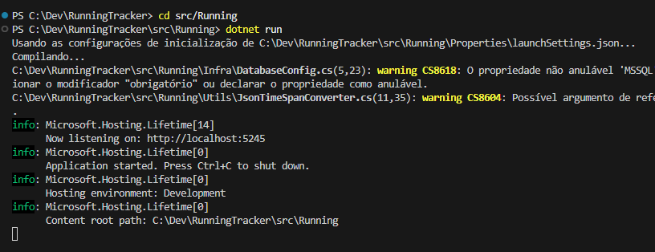
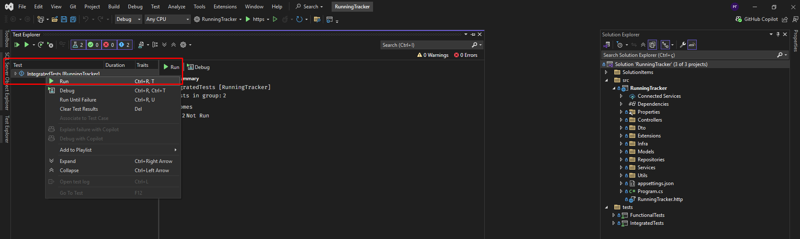
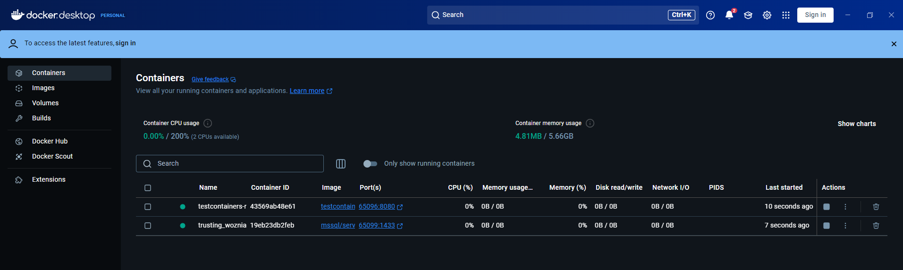
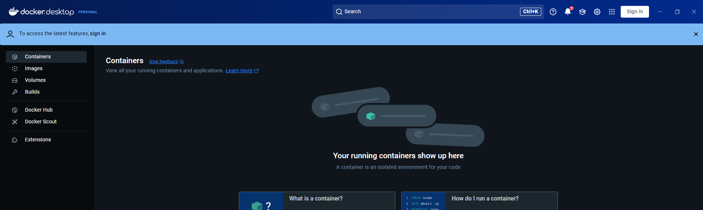
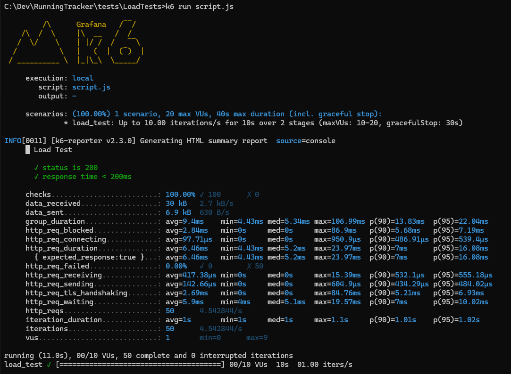
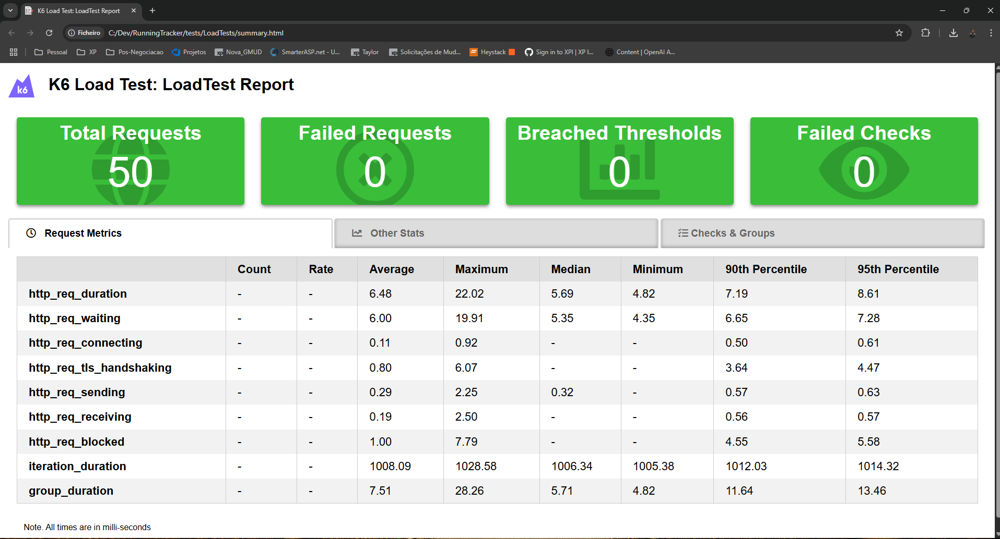

# RunningTracker API

This .NET 8 API tracks running activities, built to demonstrate comprehensive testing. I achieved 95% test coverage and validated 10k requests/sec, ensuring reliability.

## Overview

Inspired by my running hobby and procurement-honed discipline, I developed this API with .NET 8, Dapper, and SQL Server, focusing on unit (XUnit), integration (Reqnroll), functional, and load (K6) tests.

## Purpose of the project

In this project my purpose is to Highlight the tests we can use and the purpose of each one of them.

## Installation

1. Clone the repository
2. Run docker-compose up to initialize database
3. Run the project via Visual Studio

### Docker compose commands and issues

To run the docker compose and create the database:

```bash
docker-compose up
```

## Unit Tests

Unit tests are designed to test individual components or methods in isolation. They are typically fast and should not depend on external systems like databases or APIs. In this project, unit tests are used to verify the correctness of the business logic and data access layer.

Unit tests ensure maintainable code, a practice I prioritize. Whenever I am making any maintenance I always prefer to use the strategy of doing small changes and validating them with tests, and the unit tests are very handful to see if a test broke were we expected or if in some other part of the code I didn't touched something happened as well.


## FunctionalTests

The functional tests are very handful on a distributed systems with microservice architecture, let's imagine our API needs to collect data from a database (or other API's), in this test we can run it in a pre-production stage or even production and really make a request to an endpoint and check for the response, validating the communication with other apis, databases etc.

In order to run the functional tests, you need to run the project first. Then, you can run the tests.

I usually run the project via command line:

```bash
cd src/Running
dotnet run
```



Then you can run the tests via Visual Studio.

## Integrated Tests

The integrated tests are ideal for verifying end-to-end integration. So we can test all our logic with a dedicated test database.. It is critical for high-traffic APIs to check if new functionalities or even a maintenance didn't changed something it was not supposed to change.

This test actually has two setups inside it.

It will setup the application using TestApplicationFactory and also using TestContainers. Only one of them is necessary.

In order to run the integrated tests using docker, you need to run the docker compose first:

```bash
docker-compose up
```

After the docker compose is up, we can run the tests via Visual Studio.




But if you want to run only using TestContainers, you can remove the created containers:

```bash
docker compose down -v
```

And with a tool of your preference watch the containers, as I did using Docker here:



Once the test finishes you have no more running containers:



Executing with the docker-compose file it will make use of src/Infra files init.sql and entrypoint.sh to create the database and run the project 

Executing with Testcontainer it will use the nuget already configured in the IntegratedTests project.

I've had some issues running via testcontainers, had to split the database initializer into 2 methods and replace the Database in the connection string at builder.ConfigureServices:

```csharp
builder.ConfigureServices(services =>
{
    // Configure your services to use the test container's connection string
    var connectionString = _dbContainer.GetConnectionString();

    // Update your services to use the connection string
    services.Configure<DatabaseConfig>(options =>
    {
        options.MSSQL = $"{connectionString};Database=RunningTrackerDb;";
    });

    services.AddSingleton<IDbConnectionFactory, DbConnectionFactory>();
});
```

```csharp
public async Task InitializeDatabaseAsync()
{
    var createDatabaseScript = @"
        IF DB_ID('RunningTrackerDb') IS NULL
        BEGIN
            CREATE DATABASE RunningTrackerDb;
        END
    ";

    var initializeDatabaseScript = @"
        USE RunningTrackerDb;

        IF OBJECT_ID('Runs', 'U') IS NULL
        BEGIN
            CREATE TABLE Runs
            (
                Id        INT IDENTITY(1,1) PRIMARY KEY,
                Distance  FLOAT    NOT NULL,
                Duration  TIME     NOT NULL,
                Pace      FLOAT    NOT NULL,
                Date      DATE     NOT NULL,
                StartTime TIME     NOT NULL,
                EndTime   TIME     NOT NULL,
                CreatedAt DATETIME NOT NULL DEFAULT GETDATE(),
                UpdatedAt DATETIME NOT NULL DEFAULT GETDATE()
            );

            INSERT INTO Runs (
                Distance,
                Duration,
                Pace,
                Date,
                StartTime,
                EndTime,
                CreatedAt,
                UpdatedAt
            )
            VALUES (
                10.0,
                '01:00:00',
                6.0,
                '2024-08-10',
                '07:15:00',
                '08:45:00',
                GETDATE(),
                GETDATE()
            );
        END
    ";

    using (var connection = new SqlConnection(_connectionString))
    {
        await connection.OpenAsync();

        // Create the database if it doesn't exist
        using (var createDbCommand = new SqlCommand(createDatabaseScript, connection))
        {
            await createDbCommand.ExecuteNonQueryAsync();
        }

        // Initialize the database
        using (var initializeDbCommand = new SqlCommand(initializeDatabaseScript, connection))
        {
            await initializeDbCommand.ExecuteNonQueryAsync();
        }
    }
```
## Load Tests

Load tests are awesome to api's that will have many requests, we can have a stress test to check when the defined resource in terms of CPU and Memory will not support any more users for example, we can have a ramp of users to watch the degradation of response time etc.

To adjust the right resources the load test is a very handful tool.

For the Load Tests I am using the k6 tool, which is a great tool to run load tests.

To run the tests, you need to run both the project and the docker compose first:

```bash
docker-compose up
```

Then, you can run the tests via command line, make sure you are in the right directory:



This test is setup to generate the result both in the terminal and in a html file with the timestamp of the test.



K6 can be used to test http/1.1, http/2, websockets, gRPC and even kafka.

## Portfolio

Check my [portfolio](https://paolofullone.github.io/) to see my projects and articles.

## Conclusion

In a professional environment, all these tests can be setup together in a Full CI/CD pipeline. If such structure is not available we can always collect mannually the result of each test to document any maintenance or new functionality.

